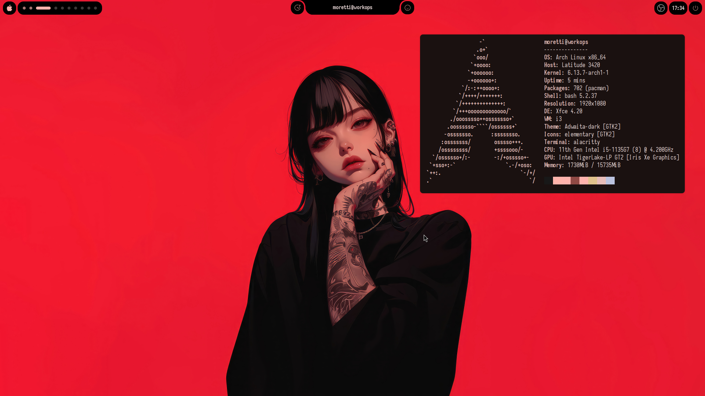
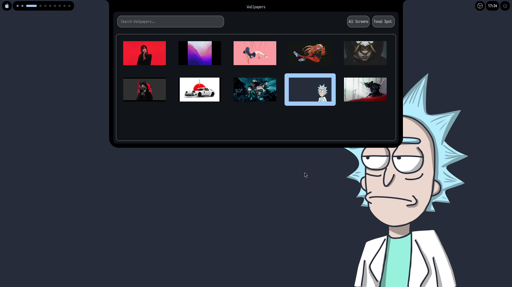
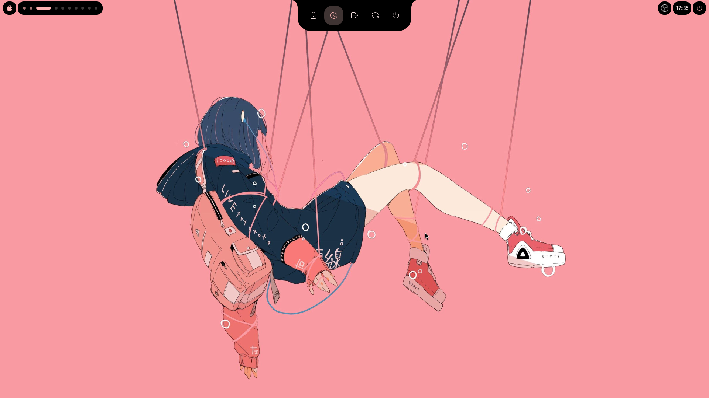
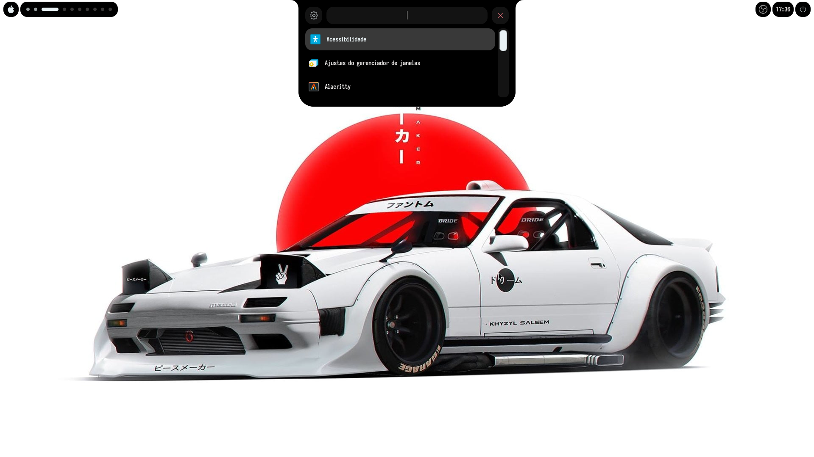
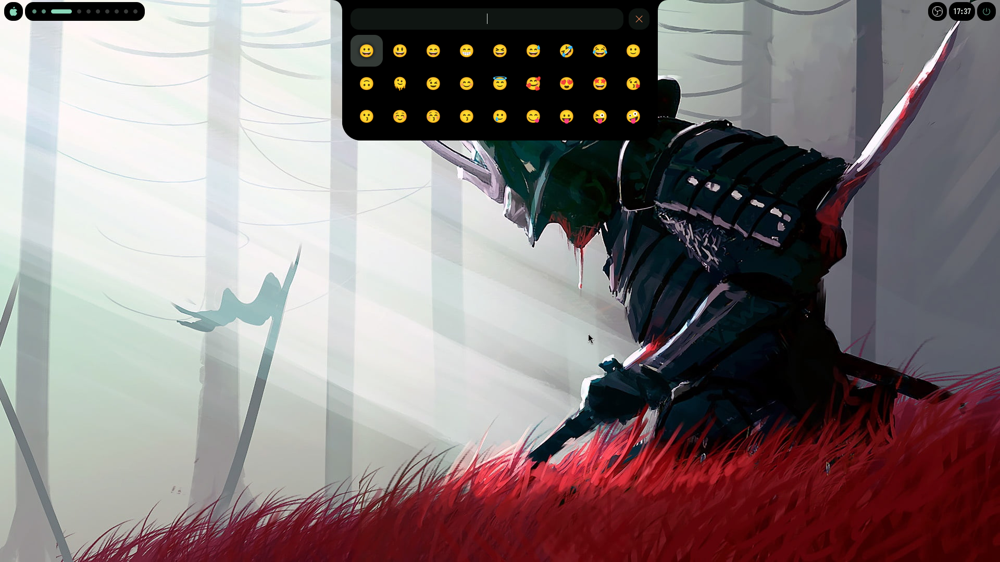

<h1 align="center"><b>MOSAIC</b></h1>

<div align="center">

[](https://github.com/jotasilv4/Mosaic/stargazers)
[](https://i3wm.org/)
[]()

</div>
<p align="center"> <sup>A ʜᴀᴄᴋᴀʙʟᴇ sʜᴇʟʟ ꜰᴏʀ i3wm, ᴘᴏᴡᴇʀᴇᴅ ʙʏ <a href="https://github.com/Fabric-Development/fabric/">Fᴀʙʀɪᴄ</a>. </sup></p>

<h2><sub></sub> Screenshots</h2>
<table align="center">
  <tr>
    <td colspan="4"></td>
  </tr>
  <tr>
    <td colspan="1"></td>
    <td colspan="1"></td>
    <td colspan="1" align="center"></td>
    <td colspan="1" align="center"></td>
  </tr>
</table>

<h2><sub></sub> Installation</h2>

> [!NOTE]
> You need a functioning I3WM installation.

### Arch Linux

> [!TIP]
> This command also works for updating an existing installation!


```bash
curl -fsSL https://raw.githubusercontent.com/jotasilv4/Mosaic/dev/install.sh | bash
```

<h2><sub></sub> Roadmap</h2>

- [x] App Launcher
- [x] Power Menu
- [x] Wallpaper Selector
- [x] System Tray
- [x] Terminal
- [x] Power Manager
- [x] Settings
- [x] Emoji Picker
- [x] Notifications
- [x] Authenticator OTP
- [ ] Dashboard
- [ ] Network Manager
- [ ] Bluetooth Manager
- [ ] Pins
- [ ] Calendar
- [ ] Color Picker
- [ ] Screenshot
- [ ] Screen Recorder
- [ ] OCR
- [ ] Workspaces Overview
- [ ] Clipboard Manager
- [ ] Vertical Layout
- [ ] Multi-monitor support
